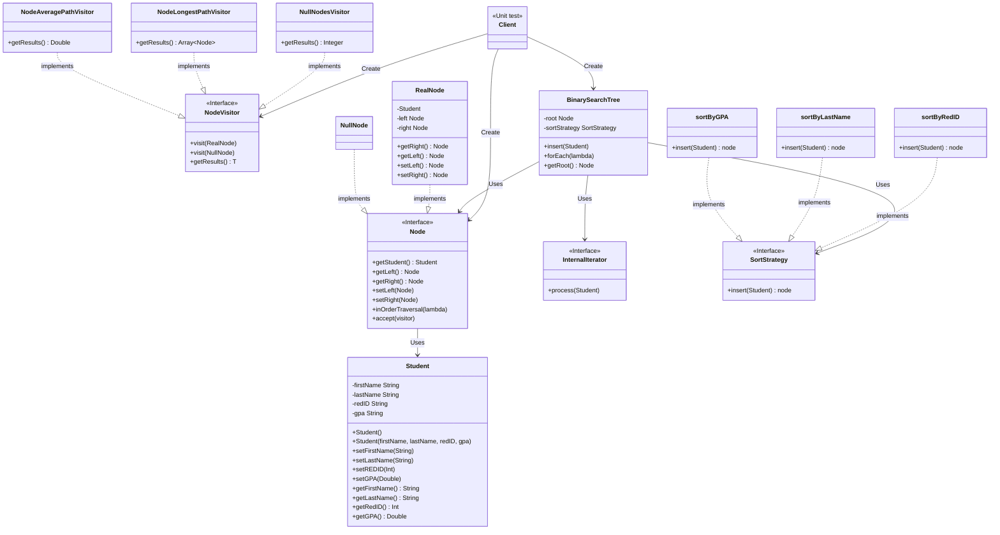

# Binary Search Tree Implementation with Design Patterns

A robust implementation of a Binary Search Tree demonstrating the use of multiple design patterns including Strategy, Visitor, Iterator, and Null Object patterns.

## Overview

This project implements a flexible Binary Search Tree data structure that can be used with different sorting strategies and traversal methods. It showcases the practical application of several design patterns to create a maintainable and extensible solution.

## Design Patterns Used

- **Strategy Pattern**: For implementing different sorting behaviors
- **Visitor Pattern**: For tree analysis operations
- **Iterator Pattern**: For tree traversal
- **Null Object Pattern**: For handling null nodes elegantly

## Class Diagram

## Components

### Core Components
- `BinarySearchTree.java`: Main BST implementation with internal iterator
- `Node.java`: Node interface
- `RealNode.java`: Concrete node implementation
- `NullNode.java`: Null object pattern implementation

### Strategy Pattern Components
- `SortStrategy.java`: Strategy interface
- `sortByGPA.java`: Sorts elements by GPA (ascending)
- `sortByRedID.java`: Sorts elements by ID (ascending)
- `sortByLastName.java`: Sorts elements by last name, then first name

### Visitor Pattern Components
- `NodeVisitor.java`: Visitor interface
- `NodePathLongestVisitor.java`: Calculates the longest path in the tree
- `NodePathAverageVisitor.java`: Calculates average path length
- `NullNodesVisitor.java`: Counts null nodes in the tree

### Data Model
- `Student.java`: Student entity class

### Testing
- `Main.java`: Main application entry point
- `MainTest.java`: Comprehensive test suite

## How It Works

1. Initialize a `BinarySearchTree` instance
2. Create a `SortStrategy` object with desired sorting strategy
3. Add student objects to the tree using the chosen strategy
4. Use visitors to analyze tree properties:
   - Count null nodes
   - Find longest path
   - Calculate average path length
5. Traverse the tree using the internal iterator
6. Compare results with expected outcomes using JUnit tests

## Tree Path Counting Logic

The implementation uses a specific approach for counting paths:

- Identical paths are counted only once
- Example: Path `87895 -> 31298 -> 10230 -> 9230` is counted as one path even if reached through different traversals
- Null node paths are handled consistently with regular node paths to maintain logical consistency

## Author

Yousif Jabbo

## Notes

- The print mode can be toggled to control result output visibility
- The internal iterator is implemented as a nested class within `BinarySearchTree`
- The Null Object pattern is used to eliminate null checks and maintain consistent behavior

## Testing

The project includes comprehensive unit tests to verify:
- Tree construction with different sorting strategies
- Path calculations
- Visitor pattern implementations
- Iterator functionality

Run `MainTest.java` for complete test coverage.
